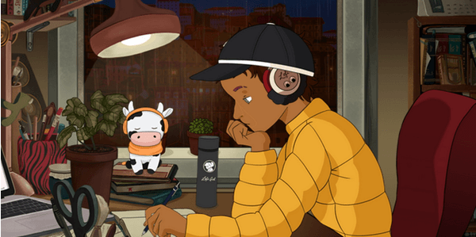

<!-- /////////////////////////////////////////////
//  VIRGILIO CABADING'S GITHUB README MARKDOWN
////////////////////////////////////////////////// -->

    

<h2>
Hi, I am ✨ Virgilio D. Cabading Jr ✨, an enthusiastic, team oriented, and quick learning Software Developer
</h2>

<h3>Languages I have experience in developing ✍🏼:</h3>

1. Javascript
2. Java
3. Python
4. HTML / CSS

<h3>Frameworks I use 📦:</h3>

1. MERN: [ MongoDB, Express, React, Node.js ]
2. Spring Boot
3. Flask

<h3>Databases I use 📊:</h3>

1. MySQL: [ workbench ]
2. MongoDB: [ NoSQL, Mongoose ]

<h3>My Education 🎓:</h3>

<table>
    <tr>
        <td>Full Stack Developer Certificate</td>
        <td>Coding Dojo</td>
    </tr>
    <tr>
        <td>B.S. Informatics</td>
        <td>Baylor University - College of Engineering and Computer Science</td>
    </tr>
</table>

<h3>Contact Me ☎:</h3>
<table>
    <tr>
        <td>1</td>
        <td>Resume</td>
        https://drive.google.com/file/d/12ZvAIBU2aejXzVhDG-rd1-AtLxt5IGwe/view?usp=sharing
        <td><a href="https://drive.google.com/file/d/12ZvAIBU2aejXzVhDG-rd1-AtLxt5IGwe/view?usp=sharing">Virgilio Cabading PDF Resume</a></td>
    </tr>
    <tr>
        <td>2</td>
        <td>Portfolio</td>
        <td><a href="https://vircabading.github.io/">Virgilio Cabading Portfolio</a></td>
    </tr>
    <tr>
        <td>3</td>
        <td>LinkedIn</td>
        <td><a href="https://www.linkedin.com/in/virgilio-cabading/">linkedin.com/in/virgilio-cabading/</a></td>
    </tr>
    <tr>
        <td>4</td>
        <td>GitHub</td>
        <td><a href="https://github.com/vircabading">https://github.com/vircabading</a></td>
    </tr>
</table>

    

<!--
**Virgilio-D-Cabading-Jr/Virgilio-D-Cabading-Jr** is a ✨ _special_ ✨ repository because its `README.md` (this file) appears on your GitHub profile.

Here are some ideas to get you started:

- 🔭 I’m currently working on ...
- 🌱 I’m currently learning ...
- 👯 I’m looking to collaborate on ...
- 🤔 I’m looking for help with ...
- 💬 Ask me about ...
- 📫 How to reach me: ...
- 😄 Pronouns: ...
- ⚡ Fun fact: ...
-->
